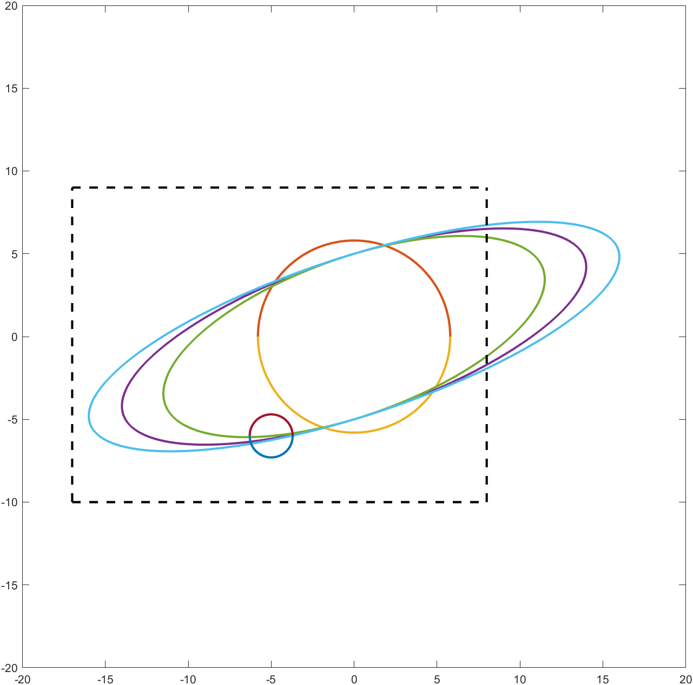
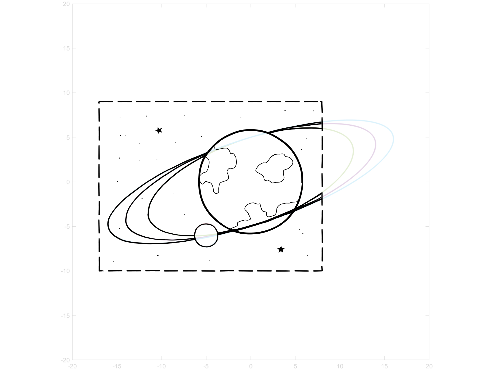
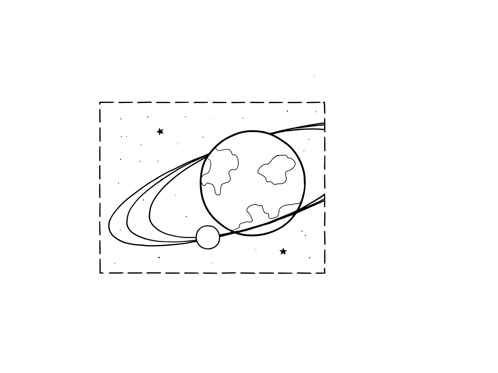

this project shows a matlab (quick hack) program generatin a ilustration of a plant with a ring system. this plot is used as base to draw a picture of the same. see below the different steps...

---------------------------------------------------------------

---------------------------------------------------------------

---------------------------------------------------------------

---------------------------------------------------------------

---------------------------------------------------------------

---------------------------------------------------------------
